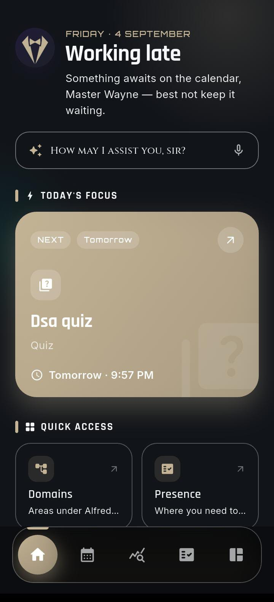
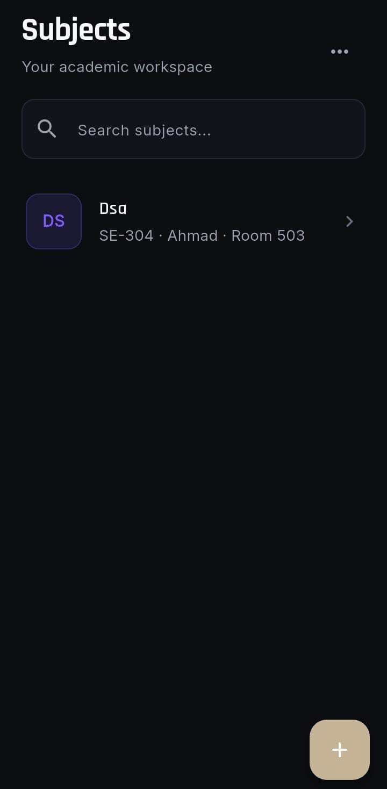
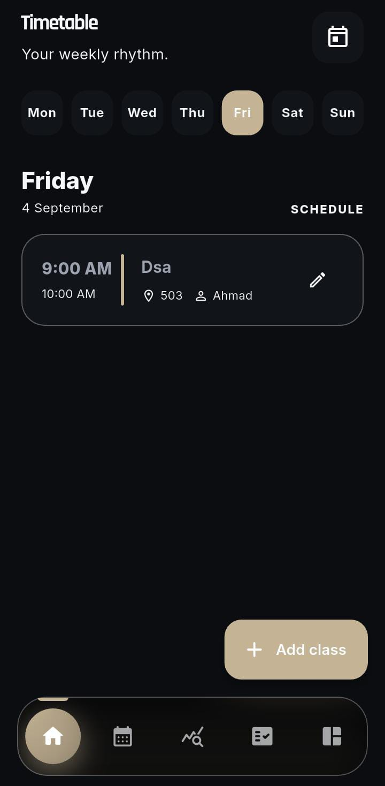
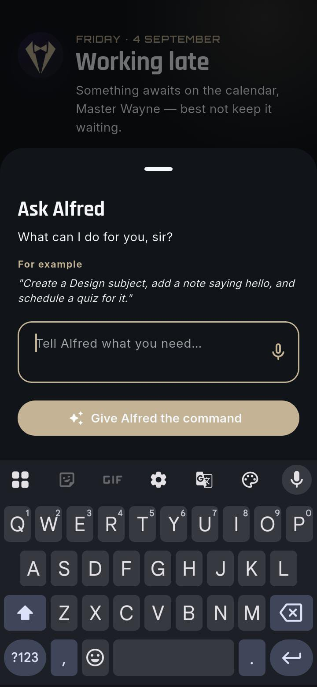

# Alfred — Your Personal Offline-First Assistant

<div align="center">


**A smart, offline-first task and life-organizer app, with an AI assistant built in.**

[Features](#features) • [Screenshots](#screenshots) • [Download](#download) • [Getting Started](#getting-started) • [AI Assistant Setup](#ai-assistant-setup) • [Roadmap](#roadmap) • [Contributing](#contributing)

</div>

---

## About

**Alfred** is a personal productivity app built for people who want one place to organize everything, not just work or just school, but daily life in general.

At its core, Alfred is built around a simple but flexible idea: **Subjects and Notes**. It looks like a school or university timetable app on the surface, but "Subject" here really just means **category** — you're not limited to classes. Create a subject called "Office," "Home," "Fitness," or anything else, and log notes, events, and tasks under it. Whether you're a student tracking assignments or a professional organizing your workweek, Alfred adapts to how you think.

It's designed to work fully offline first, with optional cloud backup, and includes a built-in AI assistant that can create tasks and events for you just by typing, or speaking, what you need.

---

## Features

**Events** — Create events for anything: a task, a reminder, a meeting, and get notified when it matters. No internet required.

**Subjects and Notes** — Organize your life into custom "subjects" (flexible categories, not just school subjects). Attach text, voice, and file notes to each one, so everything related to that area of your life stays together.

**Timetable** — Set up a recurring schedule, class times, work shifts, routines, and see your day laid out at a glance.

**Attendance** — Track attendance per scheduled class or session, with summaries over time.

**Marks / Assessments** — Track assignments, grades, and assessment components separately from regular events, with a breakdown view per subject.

**Attachments** — Attach photos, files, and voice recordings to your notes and records.

**Offline-first** — Alfred works completely offline using a local database. Your data is always available, even with no internet connection.

**Cloud backup (optional)** — Automatic and manual backup to your own Firebase project. Your data, your database, your control.

**Built-in AI assistant** — Instead of manually filling out forms, you can type a prompt in plain language (for example, "Remind me to submit the report every Friday at 5 PM") and Alfred creates the event for you. Speech-to-text support means you can do the same thing hands-free. See [AI Assistant Setup](#ai-assistant-setup) for details on providers and keys.

**Cross-platform** — Alfred isn't locked to one platform. It's available as both an Android APK and a Windows EXE, built from a single Flutter codebase.

---

## Screenshots

<div align="center">

| Home / Events | Subjects & Notes | Timetable | AI Assistant |
|:---:|:---:|:---:|:---:|
|  |  |  |  |

</div>

> See [Where to put your screenshots](#where-to-put-screenshots) for how to add your own images here.

---

## Download

| Platform | Link |
|---|---|
| Android (APK) | [Download APK](https://github.com/huzaifa0530/alfred/releases/latest) |
| Windows (EXE) | [Download EXE](https://github.com/huzaifa0530/alfred/releases/latest) |

> Builds are published under [Releases](https://github.com/huzaifa0530/alfred/releases). See [Publishing releases](#publishing-releases) below for how to publish yours.

---

## Architecture

Alfred follows **Clean Architecture**, split by feature rather than by layer-only, which keeps the codebase scalable, testable, and easy to extend. Each feature under `lib/features/` has its own `data`, `domain`, and `presentation` layers.

```
lib/
├── main.dart
│
├── app/                     # App shell: config, navigation, routing, theme
│   ├── config/
│   ├── navigation/
│   ├── router/
│   └── theme/
│
├── core/                    # Shared infrastructure used across features
│   ├── ai/                  # AI client abstraction (Gemini, Groq), persona, settings
│   ├── database/            # Drift (SQLite) database, DAOs, tables, migrations
│   ├── firebase/            # Dynamic Firebase app + credential handling
│   ├── notifications/       # Local notifications & recurring alarms
│   ├── storage/             # File storage, secure key storage
│   ├── errors/, network/, permissions/, sync/, utils/, widgets/
│
├── features/                # One folder per feature, each following data/domain/presentation
│   ├── assistant/           # AI prompt parsing & Q&A over your own data
│   ├── attachments/         # Photos, files, voice notes
│   ├── attendance/          # Attendance tracking per class/session
│   ├── backup/              # Local + cloud backup services
│   ├── events/              # Core event system (create, remind, complete)
│   ├── home/                # Home dashboard
│   ├── marks/               # Assessments / grades / mark components
│   ├── notes/                # Subject-linked notes
│   ├── settings/
│   ├── subjects/            # Subjects (categories) that everything else attaches to
│   └── timetable/           # Recurring class/work schedule
│
└── shared/                  # Shared constants, enums, models, reusable widgets
```

Within each feature:
- **`domain/`** holds entities and use cases — the business logic, independent of Flutter or any database.
- **`data/`** holds data sources, mappers, and repository implementations (local database via Drift, and Firebase for cloud sync).
- **`presentation/`** holds screens, widgets, and Riverpod controllers/providers.

This separation is what makes it straightforward for other contributors to add a feature without touching unrelated code — see [Contributing](#contributing) below.

---

## Getting Started

### Prerequisites
- [Flutter SDK](https://docs.flutter.dev/get-started/install) (this project targets Dart SDK `^3.12.0`)
- A code editor (VS Code or Android Studio recommended)
- A Firebase project (optional, only needed for cloud backup)
- A Gemini or Groq API key (optional, only needed for AI features)

### Installation

```bash
# 1. Clone the repository
git clone https://github.com/huzaifa0530/alfred.git
cd alfred

# 2. Install dependencies
flutter pub get

# 3. Run the app
flutter run
```

### Building for release

```bash
# Android APK
flutter build apk --release

# Windows EXE
flutter build windows --release
```

---

## No bundled credentials

This repository does not ship with any Firebase project, API keys, or other credentials. There is nothing to remove or rotate before you make the repo public — every user (including you) supplies their own:

- **Firebase config** — pasted into the app's own Firebase setup screen at runtime, or added locally as your own config file, which is excluded via `.gitignore`.
- **AI API key** — entered into the app's AI settings screen and stored on-device using `flutter_secure_storage`. It is never written into the codebase or committed to the repo.

This means the app is safe to make public as-is: cloning the repo gives someone the app, not your data or your keys.

---

## Cloud Backup Setup (Firebase)

Cloud backup is optional — the app runs fully offline without it. To enable it:

1. Create a project at [Firebase Console](https://console.firebase.google.com/).
2. Add an Android and/or Windows app to your Firebase project.
3. Copy your Firebase config (from `google-services.json` or the Firebase web config).
4. Paste it into Alfred's Firebase setup screen.
5. Restart the app — your data will now back up to your own Firebase project.

Your data goes to your own Firebase project. Nothing is sent to any server operated by this app.

---

## AI Assistant Setup

The AI assistant (prompt-based task creation and speech-to-text) needs an API key to work. Alfred currently supports two providers:

- **[Google Gemini](https://aistudio.google.com/)** — via Google AI Studio, free tier available.
- **[Groq](https://console.groq.com/)** — the fast-inference API platform (Groq, not to be confused with xAI's "Grok" chatbot), free tier available.

Paid tiers from either provider also work, for higher usage limits.

To set it up:
1. Get a free (or paid) API key from either provider above.
2. Open Alfred's AI settings screen and paste in your API key.
3. Start typing or speaking a task, for example:
   > "Add an event for my dentist appointment next Tuesday at 3 PM and remind me an hour before."
4. Alfred parses this and creates the event automatically.

Your API key stays on your device and is used only to talk directly to the provider you chose.

---

## Roadmap

Alfred is actively growing. Planned additions include:

- [ ] Smarter event scheduler with recurring/conditional rules
- [ ] Expanded general-purpose AI assistant, more natural and more capable beyond event creation
- [ ] iOS and macOS builds
- [ ] Theming and customization options
- [ ] More granular notification controls

Have an idea? Open an issue — see [Contributing](#contributing) below.

---

## Contributing

Contributions are welcome. Since Alfred follows Clean Architecture per feature, adding one usually looks like:

1. Fork the repo and create a branch: `git checkout -b feature/your-feature-name`
2. Add your logic in the appropriate layer (`domain` → `data` → `presentation`) inside `lib/features/`
3. Test your changes
4. Commit: `git commit -m "Add: your feature description"`
5. Push and open a Pull Request

Please open an issue first for major changes so the approach can be discussed before you invest time in it.

---

## License

This repository does not currently include a license file, which technically means all rights are reserved by default — others can view the code but not legally reuse, modify, or redistribute it.

If your goal is for people to freely use, modify, and build on Alfred (with credit to you), the **MIT License** is the standard, simple choice for projects like this: it lets anyone use and modify your code, including commercially, as long as they keep your copyright notice. You can add one in seconds:

1. On GitHub, go to your repo → **Add file** → **Create new file**.
2. Name it `LICENSE`.
3. GitHub will offer a "Choose a license template" button — pick **MIT License**, fill in your name and year, and commit.

If you'd rather keep it more restrictive (for example, "source visible but not reusable"), you can leave the repo without a license, or use something like **CC BY-NC 4.0** (free to use for non-commercial purposes only, with credit). It's entirely your call — this section can be updated once you decide.

---

## Author

**Huzaifa**
GitHub: [@huzaifa0530](https://github.com/huzaifa0530)

---

<div align="center">

If you find Alfred useful, consider giving the repo a star. It helps a lot.

</div>
